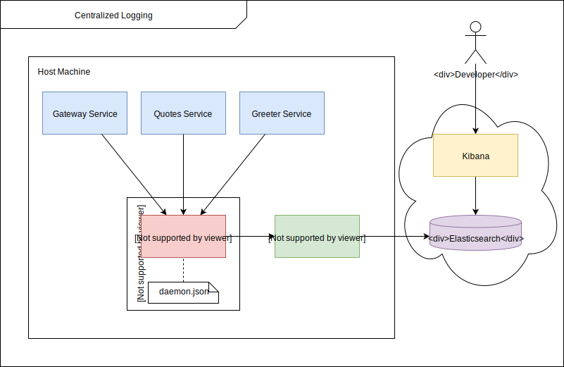

# Centralized Logging

A project to deal with logging complexities in a Microservices Architecture.

## Development Requirements

- Docker Compose v1.24.1 or higher
- Java 11
- Gradle v6.0.1 or higher

## Development Setup

1. Clone or fork & clone this repo and open the root project (centralized-logging) in your favourite IDE.

2. Start all the microservices in development mode.

    ```shell
    docker-compose up -d --build
    ```

## Centralized Logging Architecture

1. All the microservices in this architecture writes to a standard output so that we can have a plug-n-play logging architecture.

2. Every microservice will be concerned only about generating the logs and not about where they're going, how they're processed or stored.

3. This gives the developers the freedom to create a service and put it into production without dealing with any logging related configurations.

